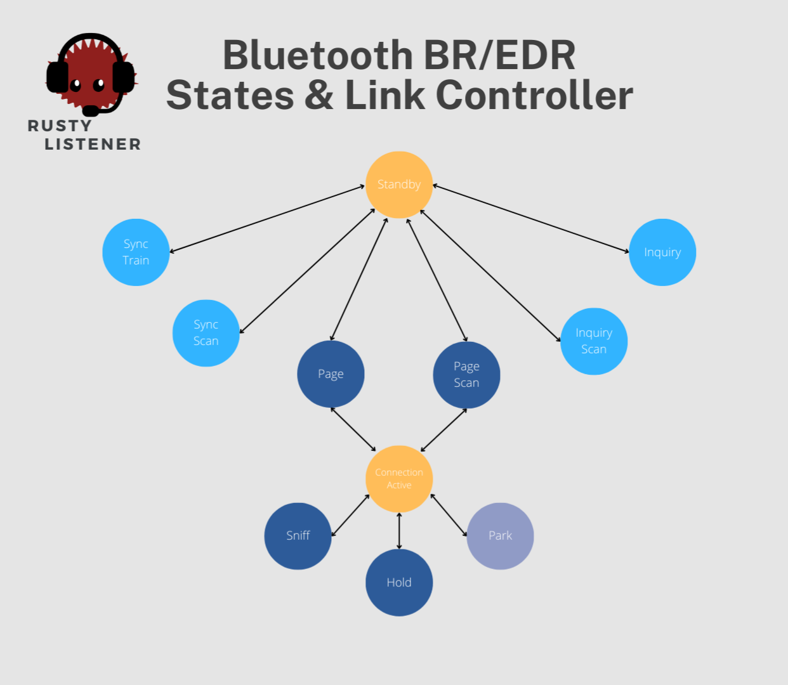
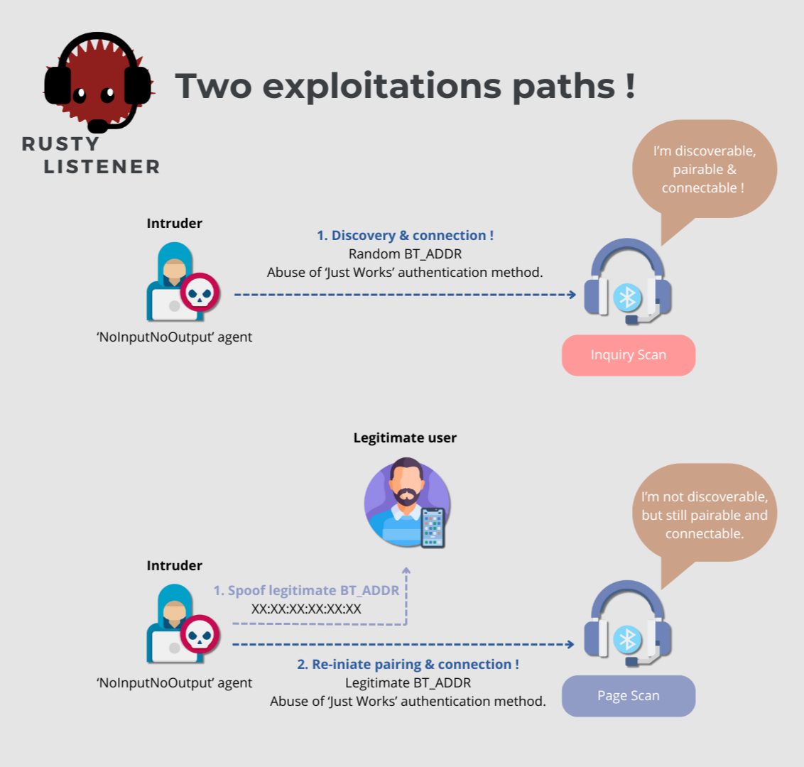
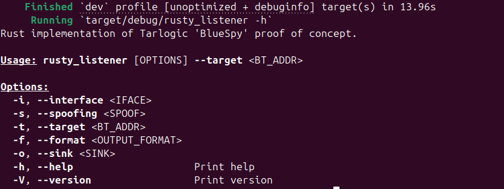

⚠️ ***Disclaimer: For Research and Educational Purposes Only**  
This project is a Proof of Concept (PoC) demonstrating Bluetooth keystroke injection, re-implemented in Rust. It is intended strictly for educational and security research purposes.*

- *Do not use this code to compromise systems without explicit authorization*.
- *Any unauthorized, illegal, or unethical use of this project is strictly prohibited.*
- *The author assumes no responsibility for misuse or damage caused by this code.*

*By downloading, cloning, or using this code, you agree to use it responsibly and in compliance with all applicable laws and regulations.*

* * *

## 🦀 Rusty Listener !

<p align="center">

</p>

Welcome to **Rusty Listener** — a Rust implementation inspired by the company Tarlogic's [BlueSpy PoC](https://github.com/TarlogicSecurity/BlueSpy), while **not associated with any specific CVE reports**, this project demonstrates the exploitation of the 'Just Works' Bluetooth authentication method, enabling unauthorized connections to Bluetooth headsets and eavesdropping on private conversations.

This PoC introduces a minor enhancement, enabling users to spoof a legitimate Bluetooth address to target a non-discoverable Bluetooth device and attempt to re-initiate pairing.

### 1\. How does it work ?

*Before getting into any details, I encourage you to read Tarlogic's web post about BlueSpy PoC, as it offers a clear and thorough explanation of the explotation of this vulnerability : [BlueSpy - Spying on Bluetooth conversations](https://www.tarlogic.com/blog/bluespy-spying-on-bluetooth-conversations/)*.  
*I've also made available a video that popularizes this vulnerability. You'll find it right here : Hacking bluetooth Headset to listen to private conversations (Would be uploaded soon)*.

📌 If you notice any missing points, areas that could be better simplified, or potential mistakes in the explanation below, please feel free to modify it and submit a merge request. I would be delighted to review your contributions and incorporate them into the repository.

From my perspective, the designers of these Bluetooth speakers and headsets need to resolve several important issues, which will be discussed in further detail later. These issues include:

- Defaulting the device to discoverable and connectable mode and keeping it so even after a legitimate device has connected.
- The lack of a physical interface (e.g., a button) to toggle pairing and discoverable modes.
- The lack of a physical interface (e.g., a button) to accept or deny Bluetooth connection requests.
- Using the "Just Works" authentication method without notifying legitimate users of connection attempts.

First of all, you must understand that this vulnerability **is only exploitable on Bluetooth BR/EDR** because it is targeting mainly the HFP (HandsFree Profile) profile standing upon this technology. To grasp all of these previous issues more in detail, we need to understand few concepts :

- What is discoverable mode and where does it come from ?
- What's 'Just Works' authentication method and why sometimes the user isn't notified.

Addressing the first question: you may have noticed when using Bluetooth IoT devices that they can exist in different states. These states are managed by the link layer of the Bluetooth stack. The schematic below illustrates the various states a Bluetooth device can occupy:

<p align="center">

</p>

**Diagram 1** : Illustration of Bluetooth BR/EDR States.

Initially, all Bluetooth devices reside in a **standby** state. In this state, Bluetooth functionality is inactive: the device is **neither discoverable, pairable, nor connectable**.  
Upon activating Bluetooth (via the user interface or a physical button), the device transitions to one of several active states. For Bluetooth speakers and headsets, the most frequent initial state is **Inquiry Scan**. In this state, the device **actively broadcasts its presence**, making it **discoverable** by other Bluetooth devices (like smartphones or computers) that are currently in Inquiry mode.  
**Inquiry** is the state where devices (typically smartphones or computers) initiate a search for nearby Bluetooth devices.

Once a user selects a desired device (e.g., a speaker) from the list of discovered devices, the initiating device (usually the smartphone) enters the **Paging** state. In this state, the initiating device transmits a signal to the selected device to establish a connection. This process, known as paging, can take time as it requires both devices to **synchronize their internal clocks**.  
During the paging process, the selected device (e.g., the speaker) must be in **Page Scan** mode to receive and respond to the paging signal.  
The device that initiates the connection through the paging process is automatically designated as the **master** in the resulting Bluetooth connection.

To prioritize user **privacy** and **security**, our device should not enter **Inquiry Scan** mode with pairable and connectable status by default. To facilitate pairing with legitimate devices, the designers should incorporate a user-friendly interface that allows users to explicitly enable or disable Inquiry Scan mode with pairable and connectable status as needed.

The other key issue enabling the exploitation of this proof of concept is the inherent vulnerability of the **'Just Works' authentication method**, as I detailed in [Rusty Injector](https://github.com/xG3nesis/RustyInjector), my Rust implementation of the 'hi_my_name_is_keyboard' PoC inspired by Marc Newlin.

Here's a quick recap :

*The Bluetooth specification offers different levels of authentication and security. Depending on the mechanism used for authentication, the level of security for the communication may vary. Devices can authenticate based on the input and output peripherals they possess, a concept referred to as association models. You have likely encountered this when pairing two devices—such as being asked to enter a PIN code displayed on the other device.*

*There are four pairing association models, determined by the devices' I/O (Input/Output) capabilities:*

- *Just Works (Unauthenticated)*
- *Numeric Comparison (Authenticated)*
- *Passkey Entry (Authenticated)*
- *Out of Band (Authenticated) – Relies on another technology to facilitate the pairing process.*

***Just work** is an authentication method that **establishes pairing without requiring user confirmation or interaction**, leaving no way to verify the authenticity of the pairing device.*

In a nutshell, the exploitation involves discovering the target device through a standard inquiry procedure, establishing a pairing and connection by exploiting the 'Just Works' authentication method. Once connected, the attacker can record audio as a legitimate device using the Hands-Free Profile (HFP) on the bluetooth stack. While implementing this PoC in Rust, I discovered that some Bluetooth speakers could be exploited even in non-discoverable mode by spoofing the Bluetooth address of a legitimate device and forcing a re-initiation of the pairing process.

<p align="center">

</p>

**Diagram 2** : Illustration of the two exploitation path possible for Rusty Listener.

### 2\. How was it implemented ?

Similar to my work on [Rusty Injector](https://github.com/xG3nesis/RustyInjector), the only purpose of this Rust implementation of the proof of concept was to gain a deeper understanding of its technical aspects. That's why in this first iteration, the global architecture was inspired by python PoC of Tarlogic : [Github "BlueSpy"](https://github.com/TarlogicSecurity/BlueSpy). In a future rework, it could be implemented in a more rusty manner.

Crates (= Rust Libraries) used during this implementation :

```toml
[dependencies]
bluer = { version = "0.17.3", features = ["l2cap", "bluetoothd", "id", "rfcomm"] }
tokio = { version = "1.43.0", features = ["full"] }
clap = { version = "4.5.23", features = ["derive"] }
regex = "1.11.1"
futures = "0.3.31"
ctrlc = "3.4.5"
```

The key dependency in my project was 'BlueR,' a Rust API built on top of the original BlueZ C library. You can check out their work here : [GitHub BlueR](https://github.com/bluez/bluer). I also integrated Tokio and Futures to enable the use of the `async` functions provided by the BlueR library. Additionally, I utilized Clap, a command-line argument parser, and Regex, a crate that implements regular expressions in Rust, to validate user inputs for the 'bt_addr' (Bluetooth Address). Finally, I integrated Ctrlc to handle SIGINT signals from the user, allowing for graceful termination of the recording process.

Additionally, external binaries from the UNIX ecosystem were required to enable pairing in non-discoverable mode, as well as to facilitate audio recording and playback.

Here are the different binaries used in our PoC :

- `btmgmt`
- `pactl`
- `parecord`
- `paplay`

I decomposed my implementation in several steps, so that you can have a better understanding of how it works :

1.  Parse user arguments which are used to get :
    - `--iface` or `-i` which stands for the bluetooth interface/adapter to use. This argument is optional, if nothing is specified, it would try to reach a default one.
    - `--target` or `-t` which is **mandatory** and specifies the bluetooth address of the target.
    - `--spoofing` or `-s`: An optional argument to specify a Bluetooth address to spoof.
    - `--format` or `-f`: An optional argument to define the format for saving the audio recording.
    - `--sink` or `-o`: Specifies the output location for the audio recording.
2.  Change the Bluetooth address of the adapter if the user wishes to spoof the identity of a legitimate Bluetooth device.
3.  Deploy a bluetooth agent with `NoInputNoOutput` capabilities to be able to access the "Just Works" pairing method during the connection with the target device.
4.  Scan the environment to check if the target device is in discoverable mode. If not, attempt to reach the device directly using the paging procedure.
5.  Initiate pairing and establish a connection with the target device.
6.  Perform audio recording and playback if requested by the user.

I've attempted to comment my code as much as possible. If you go through it, you would easily recognize all these steps.

### 3\. How to use ?

First thing to note : This tool was **developped and tested on Ubuntu 24.04**.

*As it is mentionned in the original PoC BlueSpy, this PoC requires a properly installed BlueZ Bluetooth stack, available via the bluez package on Arch Linux distributions. Additionally, an audio server compatible with PulseAudio, such as PipeWire, is needed to record and playback audio*. **If you run it on Ubuntu 24.04, as I did, you should be able to execute this PoC without requiring any additional installations.**

Aside from the core setup, the proof of concept also requires the `bdaddr` binary to change your Bluetooth adapter's address and impersonate another device.

📌Please note that `bdaddr` binary supports a limited set of manufacturers, which are :

- Ericsson
- Cambridge Silicon Radio (CSR)
- Texas Instruments (TI)
- Zeevo
- ST Microelectronics (ST)
- Cypress Semiconductors
- Intel Semiconductors

To install `bdaddr` please proceed by following these steps :

```sh
# build bdaddr from the bluez source
cd ~/
git clone --depth=1 https://github.com/bluez/bluez.git
gcc -o bdaddr ~/bluez/tools/bdaddr.c ~/bluez/src/oui.c -I ~/bluez -lbluetooth
sudo cp bdaddr /usr/local/bin/
```

Now you simply need to pull the project and compile it with `cargo build` and running the binary `rusty_listener`located in path `/target/debug/rusty_listener`. You can also run it directly by specyfing the arguments with the command :  
`cargo run -- -i [BT_INTERFACE] -t [BT_TARGET] -s [SPOOF_ADDR] -f [OUTPUT_FILE] -o [AUDIO_OUTPUT]`.

  
**Capture 1** : Command line interface of Rusty Listener.

Here is an example : `cargo run -- -i hci0 -t AA:BB:CC:DD:EE:FF -s 11:22:33:AA:BB:CC -f record.mp3 -o alsa_card.pci-0000_00_05.0.analog-stereo`

❗Lastly, if you want to change the default audio output, use `pactl list cards` to list all available audio cards. Note that you might encounter an error during recording because Bluetooth audio cards can have different names. To resolve this, connect to the Bluetooth device and run the same `pactl list cards` command to identify the name of the `HandsFree Profile`. For example, in my case, the target device's profile was named `headset-head-unit`. You’ll then need to modify line 18 in the `utils/record_play.rs` file within the Rust code accordingly.

Please note, if you don't specify any bluetooth interface, it would attempt to reach a default one. And **OBVIOUSLY**, don't forget to plug a bluetooth interface to your Ubuntu operating system.🙃

* * *

I think that i've said all, you are now ready to make the best usage of rusty listener ! If you have any issue, comments or remarks don't hesitate to put an issue. Have a great one and enjoy hacking ! 🚀